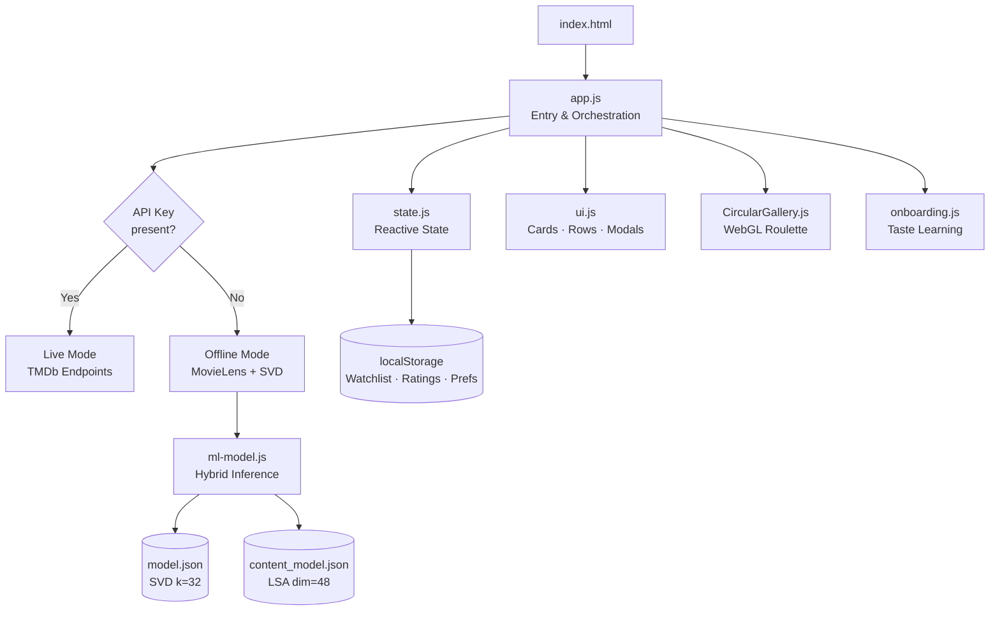
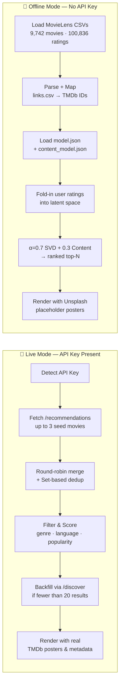
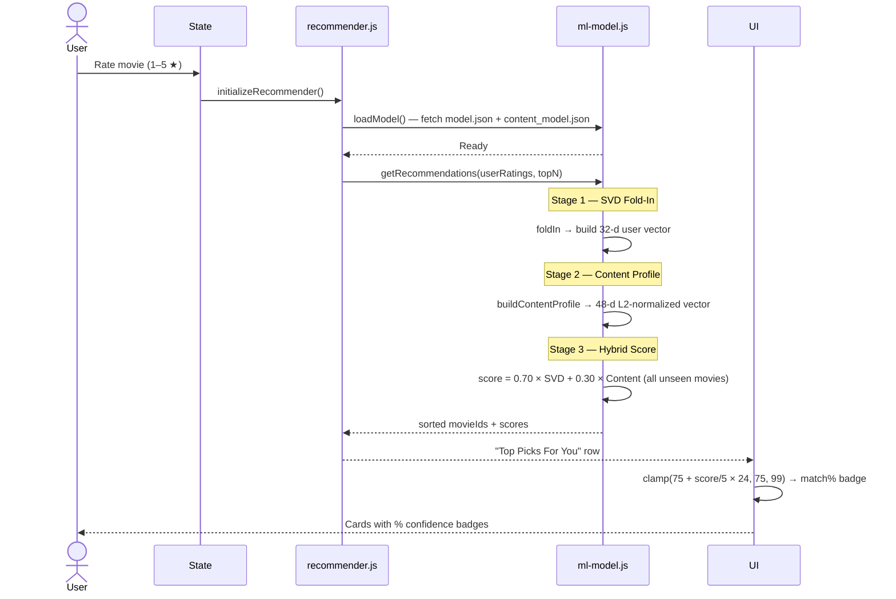
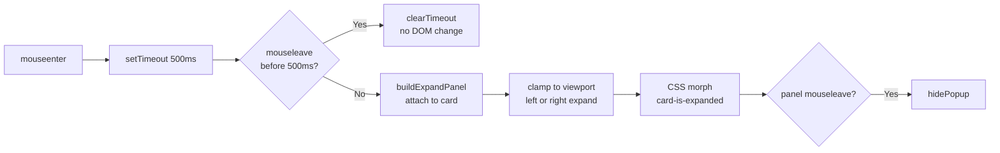
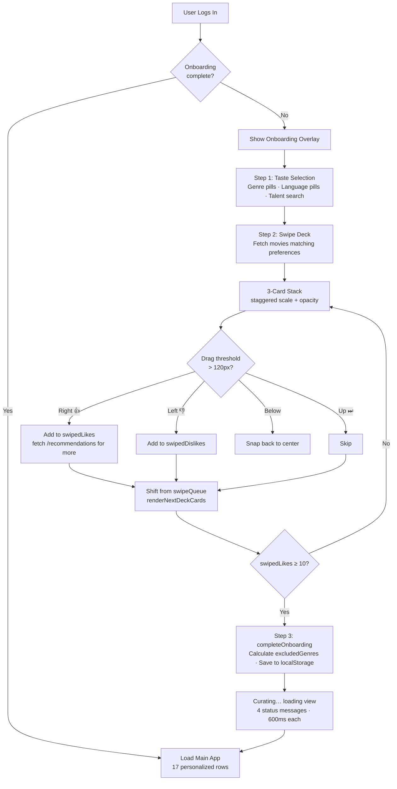
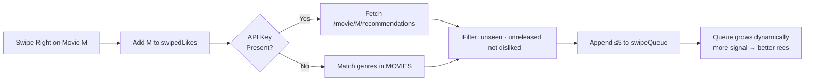
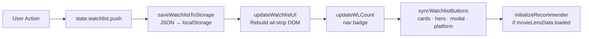
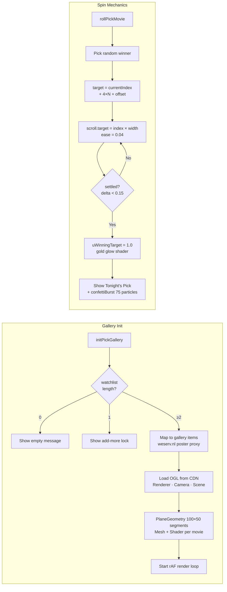
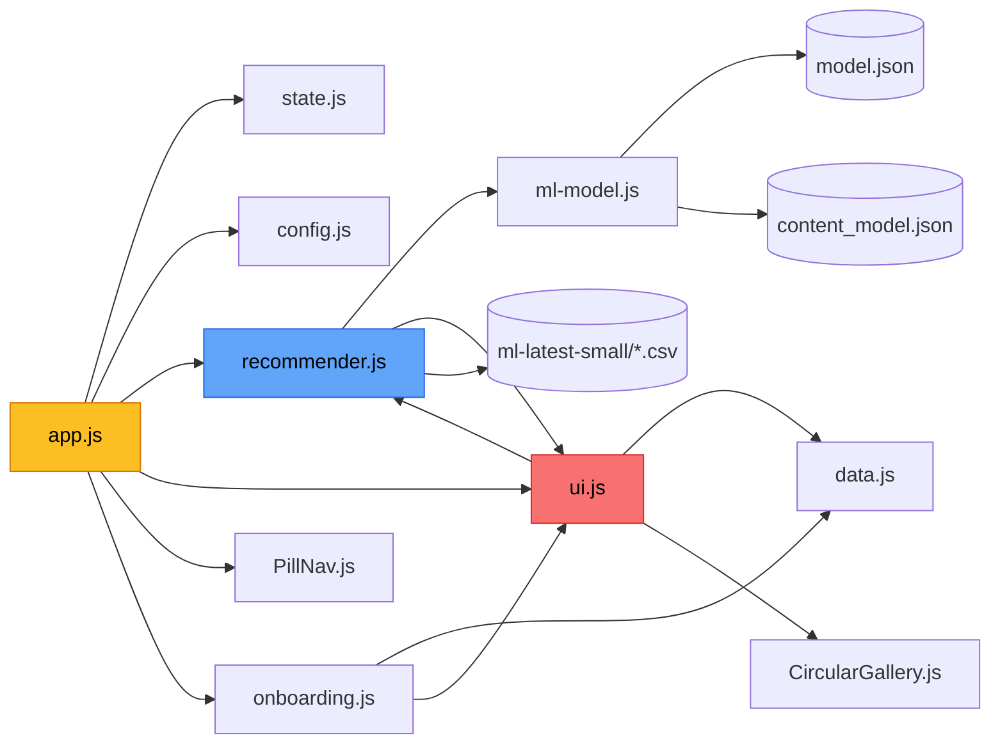

<div align="center">


# ✦ ATLASS
### *Adaptive Taste Learning And Suggestion System*

> A cinematic discovery engine that thinks like a machine learning model  
> and feels like a streaming platform — built in pure vanilla JavaScript with zero frameworks.

[](https://atlass-model.vercel.app)
[](https://developer.mozilla.org/en-US/docs/Web/JavaScript/Guide/Modules)
[](https://www.themoviedb.org/)
[](https://grouplens.org/datasets/movielens/)
[](https://github.com/oframe/ogl)
[](#license--attributions)

<br/>


</div>

---

## 📖 Table of Contents

- [What is ATLASS?](#-what-is-atlass)
- [By the Numbers](#-by-the-numbers)
- [System Architecture](#-system-architecture)
- [Dual-Mode Data Pipeline](#-dual-mode-data-pipeline)
- [The Recommendation Engine](#-the-recommendation-engine)
  - [SVD Fold-In](#svd-fold-in)
  - [Content Profile](#content-profile)
  - [Hybrid Blend](#hybrid-blend)
  - [Match % Badge](#match--badge)
  - [Live TMDb Mode](#live-tmdb-mode)
  - [Runtime Score Boosts](#runtime-score-boosts)
- [UI System Architecture](#-ui-system-architecture)
  - [Card Hover Expand](#card-hover-expand)
  - [Infinite Scroll Engine](#infinite-scroll-engine)
  - [Dynamic Glow Extraction](#dynamic-glow-extraction)
- [Onboarding & Preference Learning](#-onboarding--preference-learning)
  - [The Swipe Feedback Loop](#the-swipe-feedback-loop)
- [State Management & Persistence](#-state-management--persistence)
- [WebGL Circular Gallery — Roulette of Fate](#-webgl-circular-gallery--roulette-of-fate)
  - [The Bend Formula](#the-bend-formula)
  - [Audio Synthesis](#audio-synthesis)
  - [Shader Highlights](#shader-highlights)
- [Project Structure](#-project-structure)
- [Module Dependency Graph](#module-dependency-graph)
- [Tech Stack](#-tech-stack)
- [Running Locally](#-running-locally)
- [API Key Setup](#-api-key-setup)
- [Browser Compatibility](#-browser-compatibility)
- [License & Attributions](#-license--attributions)

---

## 🎬 What is ATLASS?

**ATLASS** is not just a movie recommender — it is a fully realized, browser-native cinematic experience that fuses machine learning with a handcrafted design system. At its core lies a dual-pipeline architecture: an offline hybrid recommendation engine trained on the **MovieLens ml-latest-small** dataset, and a live integration with the **TMDb API** that pulls real-time posters, trailers, cast data, and streaming availability. Whichever mode is active, the experience feels continuous and premium.

What makes ATLASS genuinely unusual is what it chose *not* to use. There is no React, no Vue, no component library, no build step, and no bundler. The entire application — recommendation engine, WebGL roulette, onboarding swipe deck, modal system, infinite scroll, platform browser, and a ~4,000-line CSS design system — runs as native ES modules loaded directly in the browser. The aesthetic borrows from Netflix's density, A24's editorial restraint, and high-end magazine typography. It is, from first principles to final pixel, built from scratch.

When you first open the app, a taste-learning onboarding flow greets you — genre pills, language preferences, and a swipeable movie deck that feels like Tinder for cinema. Every swipe right seeds a growing queue of similar films. Every swipe left trains ATLASS to exclude patterns you dislike. By the time you reach the main interface, ATLASS already knows your taste well enough to populate 17 personalized rows with a globally deduplicated feed. Each star rating you give folds directly into the recommendation model, refining your latent taste profile in real time — no server round-trip required.

---

## 📊 By the Numbers

| Metric | Value |
|---|---|
| Movies in dataset | 9,742 |
| User rating vectors | 610 |
| Total ratings | 100,836 |
| SVD latent factors | 32 |
| Content vector dimensions | 48 (LSA) |
| Collaborative / Content blend | α = 0.70 / 0.30 |
| CSS lines | ~4,000 |
| Core UI logic | ~2,500 lines |
| Framework dependencies | **Zero** |
| Build step | **None** |
| Personalized home rows | 17 |

---

## 🏗 System Architecture

The entire application is orchestrated from `app.js`, which boots a chain of initialization: reactive state → API-key detection → recommendation engine → UI layer → WebGL gallery → onboarding flow. Every module communicates through the shared `state` object — there is no event bus, no context provider, no store. Just one carefully managed JavaScript object and the browser's `localStorage`.



---

## 🔀 Dual-Mode Data Pipeline

ATLASS selects its operating mode automatically at startup based on whether a TMDb API key is present in `localStorage`. The switch is invisible to the user — both modes surface the same UI structure — but the data path, poster fidelity, and recommendation strategy differ meaningfully.



### Mode Comparison

| Scenario | Mode | Posters | Recommendation Source |
|---|---|---|---|
| API key in `localStorage` | Live TMDb | Real TMDb posters | `/recommendations` endpoint |
| No API key, served via HTTP | Offline MovieLens | Unsplash placeholders | SVD + Content hybrid |
| `file://` protocol | CORS-blocked | Unsplash placeholders | `DEFAULT_RECS` constant |

---

## 🧠 The Recommendation Engine

The engine is the intellectual core of ATLASS. It is not a wrapper around a hosted ML service — it is a real inference pipeline running entirely inside the browser, using pre-trained weight matrices fetched from JSON files and a fold-in algorithm that projects ratings into a latent space without ever retraining the model.



### SVD Fold-In

When a new user arrives, the model cannot retrain — the SVD decomposition was computed offline on the full MovieLens corpus. Instead, ATLASS uses the **fold-in technique**: it projects the user's known ratings into the latent space defined by the pre-trained item factors. The user vector is a weighted average of item factor vectors, where each weight is the signed deviation from the global mean:

$$\vec{u} = \frac{\sum_{i \in R_u} \bigl(\vec{v}_i \cdot (r_{ui} - \mu)\bigr) \cdot |r_{ui} - \mu|}{\sum_{i \in R_u} |r_{ui} - \mu|}$$

Where $\vec{v}_i$ is the 32-dimensional item embedding for movie $i$, $r_{ui}$ is the user's rating, and $\mu = 3.5016$ is the global mean across all 100,836 ratings. Ratings above the mean pull the user vector *toward* that item's direction; ratings below push it *away*. Deviation magnitude controls influence strength.

### Content Profile

In parallel, ATLASS builds a content-based user profile from every movie rated 3.5 stars or above. It averages their 48-dimensional LSA content vectors — derived offline from TF-IDF on Wikipedia plot text — and L2-normalizes the result so that directional similarity, not magnitude, drives scoring:

$$\vec{p}_u = \frac{\sum_{i \in R_u^+} \vec{c}_i}{\left\|\sum_{i \in R_u^+} \vec{c}_i\right\|_2}$$

### Hybrid Blend

The final score for any unseen movie $m$ is a linear interpolation between the collaborative signal and the content signal:

$$\text{score}(m, u) = \underbrace{0.70 \cdot (\vec{v}_m \cdot \vec{u})}_{\text{SVD (collaborative)}} + \underbrace{0.30 \cdot (\vec{c}_m \cdot \vec{p}_u)}_{\text{Content (semantic)}}$$

The higher weight on SVD reflects the empirical strength of collaborative signals when sufficient rating data exists. The 30% content contribution ensures the system still surfaces thematically coherent films even when the user's latent profile is sparse. Both $\alpha$ values are configurable in `ml-model.js:8`.

### Match % Badge

Raw model scores are mapped to a human-readable confidence percentage. The mapping is clamped to 75–99% to avoid the psychological noise of low numbers while preserving meaningful relative ranking:

$$\text{match\%} = \text{clamp}\!\left(75 + \frac{\text{score}}{5.0} \times 24,\ 75,\ 99\right)$$

### Live TMDb Mode

When an API key is present, the collaborative model is replaced by TMDb's own recommendation endpoint:

1. **Seed selection** — up to 3 movies from `watchlist ∪ onboardingLikes` (randomized each session)
2. **Parallel fetch** — `Promise.all([/recommendations × 3 seeds])`
3. **Round-robin interleave** — no single seed dominates the result set
4. **Set-based dedup** — first-seen wins; duplicates discarded
5. **Filter** — exclude dislikes, unreleased films, language/genre mismatches
6. **Score** — `matchingGenres × 100 + popularity / 1000`
7. **Backfill** — `/discover/movie` fills any shortfall below 20 results

### Runtime Score Boosts

User preferences from Settings layer additional boosts on top of the model score at render time, without touching the underlying model:

```js
favGenres.forEach(fg => {
    if (movieGenres.includes(fg.toLowerCase())) score += 4; // +4% per matching genre
});
if (hasFavProvider) score += 5;          // +5% for matching streaming platform
score = Math.min(99, Math.max(0, score)); // hard ceiling
```

---

## 🎨 UI System Architecture

The UI is a single `ui.js` module of over 2,500 lines. It contains the card builder, the infinite scroll engine, the modal system, the hover popup, the home section orchestrator, the platform browser, the search panel, and the hero section — all on vanilla DOM APIs with no shadow DOM, no virtual DOM, and no diffing.

```mermaid
flowchart TD
    subgraph CARD ["Card System"]
        C1[buildCard] --> C2[Create DOM\nposter · badge · quick-add]
        C2 --> C3[Async fetchTMDBDetails\nresolves poster · cast · meta]
        C2 --> C4[mouseenter → schedulePopup\n500ms delay]
        C2 --> C5[click → openModal\nfull detail view]
        C3 --> C6[genre → --glow-color\nCSS custom property]
    end

    subgraph SCROLL ["Infinite Scroll Engine"]
        S1[Snapshot original children] --> S2[Prepend 3 clones\nAppend 3 clones]
        S2 --> S3[Scroll to middle of buffer]
        S3 --> S4[passive scroll listener]
        S4 --> S5{Near right edge?}
        S5 -->|Yes| S6[appendBatch]
        S5 -->|No| S7{Near left edge?}
        S7 -->|Yes| S8[prependBatch\n+ compensate scrollLeft\nzero visual jump]
    end

    subgraph MODAL ["Modal System"]
        M1[openModal] --> M2[hash routing\n#movie-id]
        M2 --> M3[Backdrop · poster · stats grid]
        M3 --> M4[YouTube trailer embed]
        M4 --> M5[5-star rating → localStorage]
        M5 --> M6[AI reasoning pills\ncast grid · Not Interested]
    end
```



### Card Hover Expand

The Netflix-style hover popup uses a **delayed expansion** pattern to avoid accidental triggers during fast scroll:



### Infinite Scroll Engine

True infinite scroll — not pagination, not lazy loading — is achieved by maintaining a circular buffer of DOM clones. The engine prepends and appends batches as the user scrolls, compensating for the scroll position change that prepending would otherwise cause, resulting in zero visual jump in either direction.

### Dynamic Glow Extraction

Each card gets a CSS custom property `--glow-color` derived from its primary genre at render time:

| Genre | Glow Hex | Token |
|---|---|---|
| Sci-Fi | `#818cf8` | `rgba(129,140,248,0.5)` |
| Action | `#ef4444` | `rgba(239,68,68,0.5)` |
| Comedy | `#34d399` | `rgba(52,211,153,0.5)` |
| Drama | `#f59e0b` | `rgba(245,158,11,0.5)` |
| Horror | `#a855f7` | `rgba(168,85,247,0.5)` |
| Romance | `#f472b6` | `rgba(244,114,182,0.5)` |
| Thriller | `#fb923c` | `rgba(251,146,60,0.5)` |
| Default | `#a78bfa` | `rgba(167,139,250,0.5)` |

---

## 🧭 Onboarding & Preference Learning

The onboarding flow is the system's first opportunity to learn. It is a three-step sequence — taste selection, swipe feedback, and profile completion — that runs before the main app renders, ensuring even a first-time user arrives at a personalized feed.



### The Swipe Feedback Loop

The most interesting aspect of onboarding is that it doesn't stop learning once you start swiping. Every right-swipe immediately triggers a fetch for similar movies, dynamically expanding the queue without ever running out of content:



By the time onboarding completes, ATLASS has gathered enough signal to distinguish between someone who likes *cerebral* sci-fi versus someone who prefers *action* sci-fi — even if both swiped right on the same genre pill.

---

## 💾 State Management & Persistence

ATLASS has no Redux, no Zustand, no reactive store. State is a plain JavaScript object that every module imports and mutates directly. Persistence is handled by a small set of helper functions that serialize state to `localStorage` on every meaningful change — intentionally minimal and surprisingly effective.



### localStorage Schema

| Key | Format | Example |
|---|---|---|
| `user_watchlist` | `Movie[]` | `[{id:1, title:"Dune: Part Two", …}]` |
| `user_movie_ratings` | `{id: rating}` | `{"968051": 4.5, "872585": 5}` |
| `user_auth` | `{isLoggedIn, user}` | `{"isLoggedIn":true,"user":{"name":"Pranav"}}` |
| `tmdb_api_key` | `string` | `"572a69a7..."` |
| `onboarding_genres` | `number[]` | `[28, 18, 878]` |
| `fav_genres` | `string[]` | `["Action", "Drama"]` |
| `fav_providers` | `string[]` | `["netflix", "max"]` |
| `roulette_bend` | `string` | `"3.0"` |
| `confetti_enabled` | `string` | `"true"` |

---

## 🎡 WebGL Circular Gallery — Roulette of Fate

The Roulette of Fate is the most technically adventurous component in ATLASS. It is a WebGL-powered `CircularGallery` — ported and extensively customized from the React Bits OGL component — that renders your watchlist as 3D-curved poster cards on a mathematical arc. When you spin it, the gallery accelerates to a programmatically pre-chosen target index while synthesized sound effects play, then decelerates, snaps, and reveals "Tonight's Pick" with a golden border glow and a confetti burst.



### The Bend Formula

The gallery's characteristic curve is computed per-frame using a circular arc formula. Each card's position is mapped to a point on a circle whose radius is derived from the bend intensity:

Given bend magnitude $B$ and half-viewport width $H$, the arc radius is:

$$R = \frac{H^2 + B^2}{2B}$$

For a card at screen-x offset $x$, its vertical arc displacement is:

$$\text{arc} = R - \sqrt{R^2 - \min(|x|,\, H)^2}$$

Cards above center use $y = -\text{arc}$ with rotation $= -\text{sign}(x)\cdot\arcsin(eX/R)$; cards below invert both. The bend curvature (0.0–5.0) is user-configurable in Settings and persisted to `localStorage` as `roulette_bend`.

### Audio Synthesis

The spin sequence is scored entirely with the **Web Audio API** — no audio files, no samples. All sounds are synthesized from oscillators and noise at runtime:

| Sound | Synthesis | Character |
|---|---|---|
| `playTick()` | Square wave 880→440 Hz, 60 ms | Card click feedback |
| `playSpinAccel()` | Sawtooth 110→440 Hz, 1.2 s | Gallery acceleration |
| `playWhoosh()` | Bandpass noise, 1.5 s | Momentum blur |
| `playWin()` | C5-E5-G5-C6 arpeggio, triangle | Win fanfare |
| `playClick()` | Triangle 600→300 Hz, 40 ms | UI interactions |

### Shader Highlights

The GLSL fragment shader handles rounded-corner masking via a signed-distance function, aspect-fill correction, and the winning-card gold glow — all in a single pass:

```glsl
// SDF-based rounded corners
float d = roundedBoxSDF(vUv - 0.5, vec2(0.5 - uBorderRadius), uBorderRadius);
float alpha = 1.0 - smoothstep(-0.002, 0.002, d);
vec4 finalColor = vec4(color.rgb, alpha);

// Winning card: outer gold glow + inner highlight
if (d > 0.0) {
    float glow = smoothstep(0.06, 0.0, d);
    finalColor = vec4(vec3(0.96, 0.62, 0.04), glow * uWinning);
} else {
    float innerGlow = smoothstep(-0.03, 0.0, d);
    finalColor.rgb = mix(finalColor.rgb, vec3(0.96, 0.62, 0.04),
                         innerGlow * uWinning * 0.55);
}
```

---

## 📁 Project Structure

```
atlass/
├── index.html              # Single-page shell — all sections, modals, overlays
├── style.css               # ~4,000 lines, custom properties, dark/light themes
├── app.js                  # Entry point — orchestrates init sequence (72 lines)
├── state.js                # Shared reactive state + localStorage helpers (67 lines)
├── config.js               # TMDb API key, protocol detection, default rec IDs
├── recommender.js          # Recommendation orchestrator + MovieLens CSV loader (373 lines)
├── ml-model.js             # Hybrid SVD + Content model inference engine (142 lines)
├── ui.js                   # Core UI engine — cards, rows, modals, popups (2,500+ lines)
├── CircularGallery.js      # WebGL OGL-based 3D circular gallery / Roulette (311 lines)
├── PillNav.js              # GSAP-powered animated pill navigation (86 lines)
├── onboarding.js           # Taste learning flow — selection + swipe deck (742 lines)
├── data.js                 # 12-movie fallback dataset with full metadata (121 lines)
└── data/
    ├── model.json          # Pre-trained SVD model (k=32, ~500 KB)
    ├── content_model.json  # Pre-trained content model (dim=48, ~200 KB)
    └── ml-latest-small/
        ├── movies.csv      # 9,742 movies with titles and genres
        ├── ratings.csv     # 100,836 ratings from 610 users
        ├── links.csv       # MovieLens → TMDb / IMDb ID mapping
        └── tags.csv        # User-applied tags
```

### Module Dependency Graph



---

## 🛠 Tech Stack

| Layer | Technology | Why |
|---|---|---|
| Language | Vanilla JavaScript (ES Modules) | Zero build step — runs directly in browser |
| Rendering | DOM + WebGL via [OGL](https://github.com/oframe/ogl) | DOM for UI; WebGL for the 3D curved gallery |
| Collaborative Model | SVD (32 latent factors), pre-trained offline | Fold-in enables personalization at runtime without retraining |
| Content Model | TF-IDF + LSA (48-dim) | Latent semantic analysis on Wikipedia plot text |
| Dataset | [MovieLens ml-latest-small](https://grouplens.org/datasets/movielens/) | 9,742 movies · 100,836 ratings · 610 users |
| Live Data | [TMDb API v3](https://developer.themoviedb.org/docs) | Posters, trailers, cast, streaming providers |
| Fonts | Syne + DM Sans via Google Fonts | Editorial magazine aesthetic |
| Icons | Font Awesome 6 | Consistent icon system |
| Animation | CSS keyframes + GSAP + Web Audio API | Pill nav, surprise orb, WebGL spin SFX |
| State | Single shared `state` object + `localStorage` | No Redux, no reactivity library needed |
| Build | **None** | ES modules via `<script type="module">` |

---

## 🚀 Running Locally

No Node.js required. No `npm install`. Just a web server.

```bash
# Python 3 (recommended — zero dependencies)
python -m http.server 8080

# Node.js
npx serve .
```

Then open `http://localhost:8080`.

> **⚠️ Important:** Do **not** open `index.html` via `file://`. CORS policy blocks `fetch()` calls to local CSV files and the TMDb API. Always serve through a local web server.

---

## 🔑 API Key Setup

The bundled key works immediately. To substitute your own for higher rate limits:

1. Get a free key at [themoviedb.org/settings/api](https://www.themoviedb.org/settings/api)
2. Open the app → click the avatar (top-right) → **Settings** → **API** tab
3. Paste your key and click **Test**
4. A green indicator confirms the connection; the page reloads in live mode

### Offline Fallbacks

| Feature | Fallback |
|---|---|
| Movie metadata | MovieLens CSV data |
| Posters | Unsplash placeholder images |
| Match scores | `85 + ((movieId × 7) % 15)` |
| Recommendations | SVD + Content hybrid model |
| Trending | Curated MovieLens IDs |
| Platform Browser | Cached platform data |

---

## 🌐 Browser Compatibility

| Feature | Minimum |
|---|---|
| ES Modules | Chrome 61 · Firefox 60 · Safari 10.1 |
| WebGL | Any GPU-accelerated browser |
| Web Audio API | Chrome · Firefox · Safari |
| CSS Custom Properties | All modern browsers |
| `fetch()` | Chrome 42 · Firefox 39 · Safari 10.1 |
| `IntersectionObserver` | Chrome 58 · Firefox 55 · Safari 15.4 |
| `ResizeObserver` | Chrome 64 · Firefox 69 · Safari 13.1 |

---

## 📜 License & Attributions

Built for educational and portfolio purposes.

- **MovieLens Dataset** — F. Maxwell Harper and Joseph A. Konstan. 2015. *The MovieLens Datasets: History and Context.* ACM Transactions on Interactive Intelligent Systems (TiiS) 5, 4: 1–19. Used under the [GroupLens Research License](https://grouplens.org/datasets/movielens/).
- **TMDb** — This product uses the TMDb API but is not endorsed or certified by TMDb. Data subject to [TMDb Terms of Use](https://www.themoviedb.org/documentation/api/terms-of-use).
- **OGL** — WebGL library by [oframe](https://github.com/oframe/ogl), MIT License.
- **GSAP** — GreenSock Animation Platform, standard GreenSock license.
- **Font Awesome** — Font Awesome Free license.
- **Google Fonts** — Syne + DM Sans, Open Font License.

---

<div align="center">

Made with obsessive attention to detail by [4-thkind](https://github.com/4-thkind)

*No frameworks were harmed in the making of this project.*

</div>