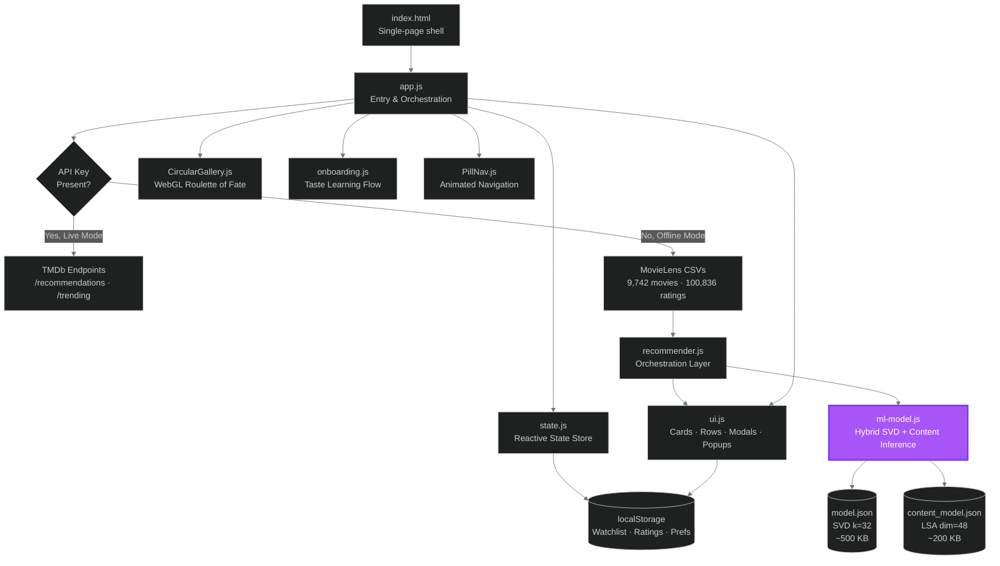
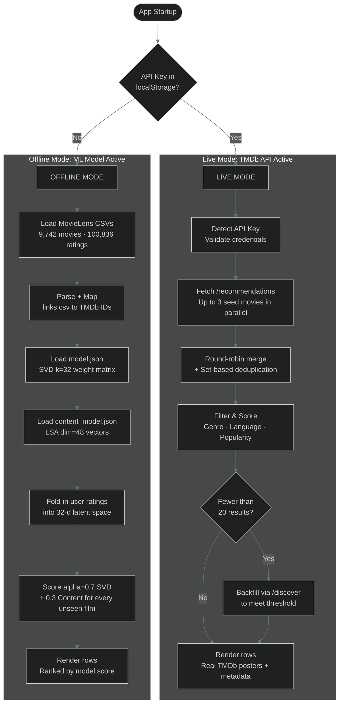
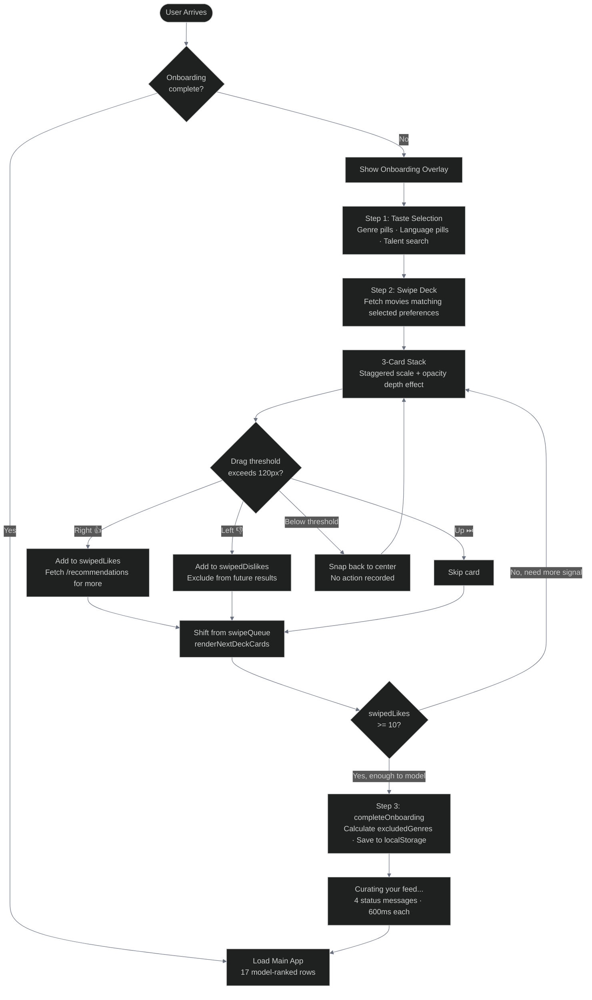
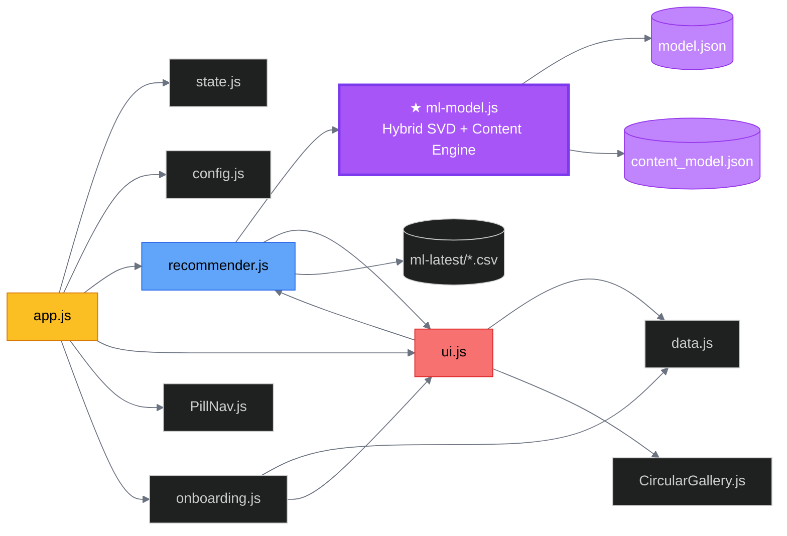

<div align="center">


# ✦ ATLASS
### *Adaptive Taste Learning And Suggestion System*

> A hybrid recommendation engine trained on 100,836 real ratings, running live inference in the browser,
> wrapped in a cinematic UI that feels like it belongs on a streaming platform.

<br/>


</div>

---

## 📖 Table of Contents

- [What is ATLASS?](#-what-is-atlass)
- [By the Numbers](#-by-the-numbers)
- [System Architecture](#-system-architecture)
- [Dual-Mode Data Pipeline](#-dual-mode-data-pipeline)
- [The Recommendation Engine](#-the-recommendation-engine)
  - [SVD Fold-In](#svd-fold-in)
  - [Content Profile](#content-profile)
  - [Hybrid Blend](#hybrid-blend)
  - [Match % Badge](#match--badge)
  - [Live TMDb Mode](#live-tmdb-mode)
  - [Runtime Score Boosts](#runtime-score-boosts)
- [UI System: Model-Driven Rendering](#-ui-system-model-driven-rendering)
  - [Card Hover Expand](#card-hover-expand)
  - [Infinite Scroll Engine](#infinite-scroll-engine)
  - [Dynamic Glow Extraction](#dynamic-glow-extraction)
- [Onboarding & Preference Learning](#-onboarding--preference-learning)
  - [The Swipe Feedback Loop](#the-swipe-feedback-loop)
- [State Management & Persistence](#-state-management--persistence)
- [WebGL Circular Gallery: Roulette of Fate](#-webgl-circular-gallery-roulette-of-fate)
  - [The Bend Formula](#the-bend-formula)
  - [Audio Synthesis](#audio-synthesis)
  - [Shader Highlights](#shader-highlights)
- [Project Structure](#-project-structure)
- [Module Dependency Graph](#module-dependency-graph)
- [Tech Stack](#-tech-stack)
- [Running Locally](#-running-locally)
- [API Key Setup](#-api-key-setup)
- [Browser Compatibility](#-browser-compatibility)
- [License & Attributions](#-license--attributions)

---

## 🎬 What is ATLASS?

**ATLASS** is a movie recommendation system we built from the ground up around a real ML pipeline. We trained a hybrid model offline on the **MovieLens ml-latest-small** corpus (100,836 ratings, 610 users, 9,742 films) and that training produced two weight matrices: a 32-dimensional SVD item-factor matrix capturing collaborative signals, and a 48-dimensional LSA content-vector matrix we derived from TF-IDF over Wikipedia plot text. Both of these get shipped as JSON files and inference runs entirely in the browser. No server, no hosted API, no external ML service.

When a user rates a movie, the model executes a **fold-in** in real time. It projects the new rating into the latent space the SVD already learned, producing a 32-d taste vector that actually encodes what the user responds to (not just which genre checkbox they ticked). That vector gets blended 70/30 with the L2-normalized content profile, scored against every unseen film in the corpus, and the results surface as personalized rows immediately. No round-trip to any server. No retraining needed.

The entire UI is downstream of the model. The 17 recommendation rows, the match percentages on each card, the "Because You Watched" sections, the onboarding swipe deck, even the WebGL 3D gallery that spins your watchlist as a roulette, all of it is populated by model-computed scores from the pre-trained weight matrices.

---

## 📊 By the Numbers

| Metric | Value |
|---|---|
| Movies in corpus | 9,742 |
| User rating vectors | 610 |
| Total ratings trained on | 100,836 |
| SVD latent dimensions | 32 |
| LSA content dimensions | 48 |
| Collaborative / Content blend | α = 0.70 / 0.30 |
| Model weight files | `model.json` (~500 KB) + `content_model.json` (~200 KB) |
| Personalized home rows | 17 |

---

## 🏗 System Architecture

`app.js` kicks off the init chain (reactive state → API-key check → recommendation engine → UI → WebGL gallery → onboarding), but `ml-model.js` is what actually drives the app. Every personalized row, every match badge, every ranked result traces back to the inference pipeline running over the trained weight matrices.



---

## 🔀 Dual-Mode Data Pipeline

At startup, the app checks if a TMDb API key exists in `localStorage`. If it does, we go live mode with real TMDb posters and metadata. If not, the ML model takes over completely and drives everything from the local MovieLens corpus. The user sees the same UI either way, but the data path underneath is quite different.



### Mode Comparison

| Scenario | Mode | Posters | Recommendation Source |
|---|---|---|---|
| API key in `localStorage` | Live TMDb | Real TMDb posters | `/recommendations` endpoint |
| No API key, served via HTTP | Offline MovieLens | Unsplash placeholders | SVD + Content hybrid model |
| `file://` protocol | CORS-blocked | Unsplash placeholders | `DEFAULT_RECS` constant |

---

## 🧠 The Recommendation Engine

This is the core of the whole project. We built an actual inference pipeline that runs in the browser using the pre-trained weight matrices. There's no wrapper around a hosted API and it's not a cosine-similarity hack over a CSV. The model loads `model.json` and `content_model.json`, and from there, every recommendation the user sees is computed locally through the fold-in algorithm.

When a user rates a movie, three things happen client-side:

1. **SVD Fold-In**: each rated film's 32-d item vector gets weighted by how far the rating deviates from the global mean (μ = 3.5016). Positive deviations pull the user vector toward that film, negative ones push away. The weighted average of these gives us a 32-d taste vector that encodes the user's actual preferences.

2. **Content Profile**: every film rated 3.5★ or higher contributes its 48-d LSA content vector (these were derived offline from TF-IDF on Wikipedia plot text). We average them and L2-normalize so direction matters, not magnitude.

3. **Hybrid Score**: for each unseen film, `0.70 × SVD_dot + 0.30 × content_dot`, ranked descending, injected as personalized rows. Match percentages get clamped to 75–99% so they stay psychologically meaningful.

The whole thing runs in `ml-model.js`. No server. No retraining.

### SVD Fold-In

The SVD was decomposed offline on the full MovieLens corpus. We can't retrain it every time a new user shows up, so we use the **fold-in technique** instead: project the user's known ratings into the latent space that the pre-trained item factors define. The user vector ends up being a weighted average of item factor vectors, where each weight is the signed deviation from the global mean:

$$\vec{u} = \frac{\sum_{i \in R_u} \bigl(\vec{v}_i \cdot (r_{ui} - \mu)\bigr) \cdot |r_{ui} - \mu|}{\sum_{i \in R_u} |r_{ui} - \mu|}$$

$\vec{v}_i$ is the 32-d item embedding for movie $i$, $r_{ui}$ is the user's rating, $\mu = 3.5016$ is the global mean across all 100,836 ratings. Ratings above the mean pull the user vector *toward* that item's direction; below pushes *away*. The magnitude of the deviation controls how much influence each rating has.

### Content Profile

In parallel, we build a content profile from every movie the user rated 3.5+ stars. We average their 48-d LSA content vectors and L2-normalize:

$$\vec{p}_u = \frac{\sum_{i \in R_u^+} \vec{c}_i}{\left\|\sum_{i \in R_u^+} \vec{c}_i\right\|_2}$$

This way the content signal is purely directional. A user who loved 3 cerebral sci-fi films gets a content vector pointing in that direction regardless of how many films they rated.

### Hybrid Blend

Final score for any unseen movie $m$:

$$\text{score}(m, u) = \underbrace{0.70 \cdot (\vec{v}_m \cdot \vec{u})}_{\text{SVD (collaborative)}} + \underbrace{0.30 \cdot (\vec{c}_m \cdot \vec{p}_u)}_{\text{Content (semantic)}}$$

We weighted SVD higher because collaborative signals are empirically stronger when there's enough rating data. The 30% content contribution keeps the system surfacing thematically coherent films even when the user's latent profile is still sparse. Both α values are configurable in `ml-model.js:8`.

### Match % Badge

We map raw model scores to a human-readable percentage, clamped to 75–99% to avoid low numbers that feel meaningless while still preserving relative ranking:

$$\text{match\%} = \text{clamp}\!\left(75 + \frac{\text{score}}{5.0} \times 24,\ 75,\ 99\right)$$

### Live TMDb Mode

When an API key is present, the collaborative model gets swapped out for TMDb's own recommendation endpoint:

1. Pick up to 3 seed movies from `watchlist ∪ onboardingLikes` (randomized per session)
2. Fire `Promise.all([/recommendations × 3 seeds])` in parallel
3. Round-robin interleave the results so no single seed dominates
4. Deduplicate (first-seen wins)
5. Filter out dislikes, unreleased films, language/genre mismatches
6. Score with `matchingGenres × 100 + popularity / 1000`
7. If we're still under 20 results, backfill from `/discover/movie`

### Runtime Score Boosts

On top of the model score, user preferences from Settings add runtime boosts at render time. These don't touch the underlying model, just nudge the display ranking:

```js
favGenres.forEach(fg => {
    if (movieGenres.includes(fg.toLowerCase())) score += 4; // +4% per matching genre
});
if (hasFavProvider) score += 5;          // +5% for matching streaming platform
score = Math.min(99, Math.max(0, score)); // hard ceiling
```

---

## 🎨 UI System: Model-Driven Rendering

The UI doesn't have its own logic for deciding what to show. Everything on screen is a direct render of the model's output. The card builder reads model scores, row titles reflect which signal generated them, and match badges display the computed probabilities straight from the hybrid pipeline.

Here's how the rendering works in practice:

**Row Orchestration** - `ml-model.js` produces ranked recommendation lists that get grouped into 17 themed sections ("Because You Watched", "Top Picks For You", genre-based clusters, etc.). Each row is populated entirely by model-scored results.

**Card Construction** - `buildCard()` receives a movie object with its model score already attached. It creates the DOM (poster, match badge, quick-add button) and then fires an async fetch to TMDb for the high-res poster, cast data, and trailer metadata.

**Match Badge** - The percentage on each card is the model's hybrid score mapped through the clamp formula above. It's the actual dot product of the user's taste vector against that film's embeddings, not a random number.

**Hover Popup** - Hovering a card triggers a 500ms debounced timer, then `buildExpandPanel` renders an expanded card with synopsis, genre tags, and streaming availability.

**Modal System** - Clicking opens a full detail modal with hash routing (`#movie-id`), YouTube trailer embed, 5-star rating widget (which feeds right back into the model), cast grid, and a "Not Interested" button for the exclusion list.

### Card Hover Expand

We used a delayed expansion pattern to prevent accidental triggers during fast scrolls. `mouseenter` starts a 500ms `setTimeout`. If `mouseleave` fires before it completes, `clearTimeout` kills it and nothing happens. If the hover holds, `buildExpandPanel` attaches to the card, clamped to the viewport edge (expands left or right depending on position). A `card-is-expanded` CSS class morphs the card, and `mouseleave` on the panel collapses everything back.

### Infinite Scroll Engine

This is true infinite scroll, not pagination or lazy loading. We maintain a circular buffer of DOM clones, prepending and appending batches as the user scrolls. When we prepend, we compensate the scroll position so there's zero visual jump. Each new batch of cards comes from the next slice of model-ranked results, so even cards you scroll far to reach are still ordered by recommendation score.

### Dynamic Glow Extraction

Each card gets a `--glow-color` CSS custom property derived from its primary genre at render time:

| Genre | Glow Hex | Token |
|---|---|---|
| Sci-Fi | `#818cf8` | `rgba(129,140,248,0.5)` |
| Action | `#ef4444` | `rgba(239,68,68,0.5)` |
| Comedy | `#34d399` | `rgba(52,211,153,0.5)` |
| Drama | `#f59e0b` | `rgba(245,158,11,0.5)` |
| Horror | `#a855f7` | `rgba(168,85,247,0.5)` |
| Romance | `#f472b6` | `rgba(244,114,182,0.5)` |
| Thriller | `#fb923c` | `rgba(251,146,60,0.5)` |
| Default | `#a78bfa` | `rgba(167,139,250,0.5)` |

---

## 🧭 Onboarding & Preference Learning

The onboarding flow solves the cold-start problem for the model. It's a three-step sequence that runs before the main app renders, gathering enough signal to populate a fully personalized feed even for a brand new user. Genre and language preferences seed the initial content profile, and the swipe decisions train the exclusion list while warming up the taste vector with real interaction data.



### The Swipe Feedback Loop

The deck keeps learning as you swipe. Every right-swipe immediately fires a fetch for `/movie/M/recommendations` (live mode) or runs a genre match against the offline corpus, and up to 5 new cards get appended to the swipe queue. If that fetch returns nothing, genre constraints loosen and it retries. By the time onboarding finishes, the model has enough signal to tell apart *cerebral* sci-fi from *action* sci-fi, even if the user selected the same genre pill for both.

---

## 💾 State Management & Persistence

State is a centralized object that every module reads and writes to directly. When ratings change, the pipeline re-runs immediately:

1. Rating gets written to `state.ratings` and persisted to `localStorage`
2. `initializeRecommender()` fires, re-running the full fold-in + hybrid score pass
3. All 17 personalized rows re-render with the freshly ranked results
4. Match badges update to reflect the new taste vector

So every star you give a movie reshapes the entire feed on the spot. The model re-scores every unseen film and the UI re-renders every row.

### localStorage Schema

| Key | Format | Example |
|---|---|---|
| `user_watchlist` | `Movie[]` | `[{id:1, title:"Dune: Part Two", …}]` |
| `user_movie_ratings` | `{id: rating}` | `{"968051": 4.5, "872585": 5}` |
| `user_auth` | `{isLoggedIn, user}` | `{"isLoggedIn":true,"user":{"name":"Pranav"}}` |
| `tmdb_api_key` | `string` | `"572a69a7..."` |
| `onboarding_genres` | `number[]` | `[28, 18, 878]` |
| `fav_genres` | `string[]` | `["Action", "Drama"]` |
| `fav_providers` | `string[]` | `["netflix", "max"]` |
| `roulette_bend` | `string` | `"3.0"` |
| `confetti_enabled` | `string` | `"true"` |

---

## 🎡 WebGL Circular Gallery: Roulette of Fate

This is the most technically involved piece of the project. It's a WebGL-powered `CircularGallery` (ported and heavily customized from the React Bits OGL component) that renders the user's watchlist as 3D-curved poster cards on a mathematical arc. Spinning it accelerates to a pre-chosen target index with synthesized sound effects, then decelerates, snaps, and reveals "Tonight's Pick" with a golden glow and confetti burst.

**Initialization:** watchlist items get mapped to gallery cards through a `weserv.nl` poster proxy. We build the OGL renderer, camera, and scene from scratch: `PlaneGeometry` with 100×50 segments per card, one mesh and shader per movie, all running in a 60fps `requestAnimationFrame` loop.

**Spin mechanics:** clicking "Spin It!" picks a random winner, computes a target scroll as `currentIndex + 4×N + offset`, and sets `scroll.target`. Each frame eases toward it at factor `0.04`. Once the delta drops below 0.15, `uWinningTarget` flips to activate the gold glow shader and confetti fires 75 particles.

**Self-contained:** the component manages its own OGL context, animation loop, audio synthesis, and confetti system. It talks to the rest of the app only through the shared `state` object, reading watchlist on init and writing the selected movie on win.

### The Bend Formula

The curve is computed per-frame. Each card's position maps to a point on a circle whose radius depends on bend intensity:

Given bend magnitude $B$ and half-viewport width $H$, arc radius:

$$R = \frac{H^2 + B^2}{2B}$$

For a card at screen-x offset $x$, vertical arc displacement:

$$\text{arc} = R - \sqrt{R^2 - \min(|x|,\, H)^2}$$

Cards above center use $y = -\text{arc}$ with rotation $= -\text{sign}(x)\cdot\arcsin(eX/R)$; cards below invert both. Bend curvature (0.0–5.0) is user-configurable in Settings, persisted as `roulette_bend`.

### Audio Synthesis

All spin sounds are synthesized at runtime with the **Web Audio API**. No audio files anywhere:

| Sound | Synthesis | Character |
|---|---|---|
| `playTick()` | Square wave 880→440 Hz, 60 ms | Card click feedback |
| `playSpinAccel()` | Sawtooth 110→440 Hz, 1.2 s | Gallery acceleration |
| `playWhoosh()` | Bandpass noise, 1.5 s | Momentum blur |
| `playWin()` | C5-E5-G5-C6 arpeggio, triangle | Win fanfare |
| `playClick()` | Triangle 600→300 Hz, 40 ms | UI interactions |

### Shader Highlights

The GLSL fragment shader does rounded-corner masking via SDF, aspect-fill correction, and the winning-card gold glow in a single pass:

```glsl
// SDF-based rounded corners
float d = roundedBoxSDF(vUv - 0.5, vec2(0.5 - uBorderRadius), uBorderRadius);
float alpha = 1.0 - smoothstep(-0.002, 0.002, d);
vec4 finalColor = vec4(color.rgb, alpha);

// Winning card: outer gold glow + inner highlight
if (d > 0.0) {
    float glow = smoothstep(0.06, 0.0, d);
    finalColor = vec4(vec3(0.96, 0.62, 0.04), glow * uWinning);
} else {
    float innerGlow = smoothstep(-0.03, 0.0, d);
    finalColor.rgb = mix(finalColor.rgb, vec3(0.96, 0.62, 0.04),
                         innerGlow * uWinning * 0.55);
}
```

---

## 📁 Project Structure

```
atlass/
├── index.html              # Single-page shell, all sections, modals, overlays
├── style.css               # ~4,000 lines, custom properties, dark/light themes
├── app.js                  # Entry point, orchestrates init sequence (72 lines)
├── state.js                # Shared reactive state + localStorage helpers (67 lines)
├── config.js               # TMDb API key, protocol detection, default rec IDs
├── recommender.js          # Recommendation orchestrator + MovieLens CSV loader (373 lines)
├── ml-model.js             # ★ Hybrid SVD + Content model, the brain of ATLASS (142 lines)
├── ui.js                   # Model-driven UI renderer, cards, rows, modals, popups (2,500+ lines)
├── CircularGallery.js      # WebGL OGL-based 3D circular gallery / Roulette (311 lines)
├── PillNav.js              # GSAP-powered animated pill navigation (86 lines)
├── onboarding.js           # Taste learning flow, selection + swipe deck (742 lines)
├── data.js                 # 12-movie fallback dataset with full metadata (121 lines)
└── data/
    ├── model.json          # Pre-trained SVD model (k=32, ~500 KB)
    ├── content_model.json  # Pre-trained content model (dim=48, ~200 KB)
    └── ml-latest-small/
        ├── movies.csv      # 9,742 movies with titles and genres
        ├── ratings.csv     # 100,836 ratings from 610 users
        ├── links.csv       # MovieLens to TMDb / IMDb ID mapping
        └── tags.csv        # User-applied tags
```

### Module Dependency Graph



---

## 🛠 Tech Stack

| Layer | Technology | Role |
|---|---|---|
| ML, Collaborative | SVD (32 latent factors), pre-trained offline | Fold-in enables real-time personalization without retraining |
| ML, Content | TF-IDF + LSA (48 dimensions) | Latent semantic analysis on Wikipedia plot text for semantic matching |
| ML, Inference | Browser-native JSON weight matrices | Trained model ships as `model.json` + `content_model.json`; inference runs client-side |
| Dataset | [MovieLens ml-latest-small](https://grouplens.org/datasets/movielens/) | 9,742 movies · 100,836 ratings · 610 users |
| Live Data | [TMDb API v3](https://developer.themoviedb.org/docs) | Posters, trailers, cast, streaming providers |
| Rendering | DOM + WebGL via [OGL](https://github.com/oframe/ogl) | DOM for standard UI; WebGL for the 3D curved gallery |
| Fonts | Syne + DM Sans via Google Fonts | Editorial magazine aesthetic |
| Icons | Font Awesome 6 | Consistent icon system |
| Animation | CSS keyframes + GSAP + Web Audio API | Pill nav, surprise orb, WebGL spin SFX |
| State | Single shared `state` object + `localStorage` | Every rating change re-triggers full ML inference |

---

## 🚀 Running Locally

```bash
# Python 3
python -m http.server 8080

# or Node.js
npx serve .
```

Then open `http://localhost:8080`.

> **⚠️ Important:** Don't open `index.html` via `file://`. CORS blocks `fetch()` calls to local CSVs and TMDb. Use a local server.

On first load the app fetches `model.json` (~500 KB) and `content_model.json` (~200 KB) from `data/`. These are the pre-trained weight matrices. After that, ratings are read from `localStorage` and inference re-runs in under 50ms.

---

## 🔑 API Key Setup

A bundled fallback key is included so it works out of the box. For higher rate limits, use your own:

1. Get a free key at [themoviedb.org/settings/api](https://www.themoviedb.org/settings/api)
2. Open the app → avatar (top-right) → **Settings** → **API** tab
3. Paste your key and hit **Test**
4. Green indicator confirms the connection, page reloads in live mode

### Offline Fallbacks

Without an API key, everything degrades gracefully. The ML model keeps driving all recommendations:

| Feature | Fallback |
|---|---|
| Movie metadata | MovieLens CSV data |
| Posters | Unsplash placeholder images |
| Match scores | SVD + Content hybrid model scores |
| Recommendations | Full SVD + Content inference pipeline |
| Trending | Curated high-rated MovieLens IDs |
| Platform Browser | Cached platform data |

---

## 🌐 Browser Compatibility

| Feature | Minimum |
|---|---|
| ES Modules | Chrome 61 · Firefox 60 · Safari 10.1 |
| WebGL | Any GPU-accelerated browser |
| Web Audio API | Chrome · Firefox · Safari |
| CSS Custom Properties | All modern browsers |
| `fetch()` | Chrome 42 · Firefox 39 · Safari 10.1 |
| `IntersectionObserver` | Chrome 58 · Firefox 55 · Safari 15.4 |
| `ResizeObserver` | Chrome 64 · Firefox 69 · Safari 13.1 |

The ML pipeline and core UI work wherever ES Modules and `fetch()` are supported. WebGL is only needed for the Roulette gallery.

---

## 📜 License & Attributions

Built for educational and portfolio purposes.

- **MovieLens Dataset**: F. Maxwell Harper and Joseph A. Konstan. 2015. *The MovieLens Datasets: History and Context.* ACM TiiS 5, 4: 1–19. [GroupLens Research License](https://grouplens.org/datasets/movielens/).
- **TMDb**: This product uses the TMDb API but is not endorsed or certified by TMDb. [Terms of Use](https://www.themoviedb.org/documentation/api/terms-of-use).
- **OGL**: WebGL library by [oframe](https://github.com/oframe/ogl), MIT License.
- **GSAP**: GreenSock Animation Platform, standard GreenSock license.
- **Font Awesome**: Font Awesome Free license.
- **Google Fonts**: Syne + DM Sans, Open Font License.

---

<div align="center">

Built by [Utkarsh Singh](https://github.com/4-thkind) & [Pranav Pant](https://github.com/pranavpant9916-ctrl)

*The model runs in your browser. Every recommendation is earned.*

</div>